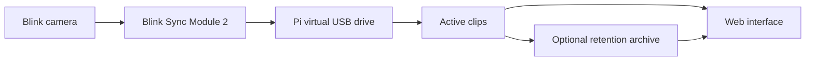

# Watchman


Watchman turns a Raspberry Pi into a virtual USB drive for a Blink Sync Module 2. It collects motion recordings for local browsing, playback, and downloads without a Blink subscription.

Read the project write-up: [Blink Vibe-Coded Raspberry Pi](https://renanm.com/blog/blink-vibe-coded-raspberry-pi/).


## Features

- Browse recordings by date, camera, or filename, with thumbnails and duration badges.
- Star clips and view them together at `/starred`.
- Move older clips to a retention archive and play them from the calendar.
- See active and archived clip counts and sizes at `/dashboard`.
- Configure retention, Pushover, optional Nextcloud uploads, and playback at `/settings`.

> [!WARNING]
> Watchman has no login. Anyone who can reach its web port can access recordings and administrative controls. Keep it on a trusted LAN; use an authenticated, encrypted access layer for remote access. Stars do not protect clips from deletion.

## How It Works



Watchman waits for USB writes to settle, disconnects the gadget, mounts its backing image locally, ingests clips, and reconnects. Retention is a separate web-triggered operation, not part of this ingest loop.

## Quick Start

Start with a Raspberry Pi Zero 2 W, Raspberry Pi OS, a Blink Sync Module 2, storage for the image and clips, and a USB **data** cable. Other boards need verified USB gadget support; do not assume every Pi or USB port supports it. See [hardware and installation](docs/installation.md) before connecting or installing.

**On the Pi**, logged in as the user that should own the recordings:

```bash
git clone https://github.com/renanfernandes/watchman.git "$HOME/watchman"
cd "$HOME/watchman"
sudo bash setup.sh
sudo nano /etc/watchman/watchman.conf
sudo chown root:"$(id -gn)" /etc/watchman/watchman.conf
sudo chmod 660 /etc/watchman/watchman.conf
test -w /etc/watchman/watchman.conf && echo "Config is writable"
sudo reboot
```

Review notification credentials and watchdog settings before rebooting. Setup also enables a hardware watchdog, disables Wi-Fi power saving, and schedules a monthly reboot. The permission commands assume the installing user's primary group, as described in the installation guide.

After reboot, open `http://<pi-ip>:5000`. For upgrades, use the [backup, update, and rollback procedure](docs/operations.md#updates); the personal deployment script is not included in a GitHub clone.

## Documentation

| Guide | Contents |
| --- | --- |
| [Installation](docs/installation.md) | Hardware, wiring, setup side effects, first-run validation |
| [Configuration](docs/configuration.md) | Shipped values, runtime configuration, credentials and permissions |
| [Web interface](docs/web-interface.md) | Calendars, stars, dashboard, playback and limitations |
| [Storage](docs/storage.md) | Retention, Nextcloud, mounts, metadata and backups |
| [Operations](docs/operations.md) | Updates, rollback, services, logs and troubleshooting |
| [Changelog](CHANGELOG.md) | Current changes and release-history policy |

## Project Layout

| Source | Purpose |
| --- | --- |
| [watchman.py](watchman.py) | USB gadget lifecycle, ingest, thumbnails and metadata |
| [web.py](web.py) | Flask application, clip management, retention and integrations |
| [templates/](templates/) | Browser, dashboard, settings and starred views |
| [watchman.conf.example](watchman.conf.example) | Public configuration template |
| [setup.sh](setup.sh) | Full system installation |
| [scripts/](scripts/) | Disk creation, first-install wrapper and watchdog helpers |
| [services/](services/) | systemd unit templates |

The local configuration and personal deployment/troubleshooting scripts are ignored by Git. Never add credentials to the public configuration example or paste unredacted config files into GitHub issues.

## Contributing and License

Keep changes focused and update the relevant guide when behavior changes. Documentation checks run in GitHub Actions; see [local validation](docs/operations.md#documentation-checks).

The project has historically declared MIT licensing, but this repository does not currently include a standalone license file. The maintainer should confirm the applicable copyright attribution and add the complete license text before relying on that declaration for redistribution.
