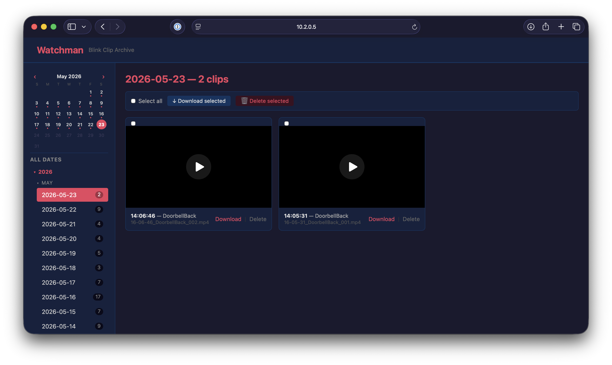

# Watchman

> Read the full write-up: [Blink Vibe-Coded Raspberry Pi](https://renanm.com/blog/blink-vibe-coded-raspberry-pi/)

Watchman is a elegant solution to a problem I had: How to properly access and manage the recordings from my Blink Cameras without an active subscription? 
Watchman makes a Raspberry Pi (in my case the Zero 2 W) act as a virtual USB drive ("GhostDrive") for a
Blink Sync Module 2. Intercepts motion-triggered `.mp4` clips and archives them
locally for remote access: **no Blink subscription needed.**



## Release Notes

Recent updates focus on making Watchman feel more polished and operational:

- A new dashboard page with clip counts, archive size, newest clip date, service health, and last sync/import indicators.
- Search and camera filtering in the clip browser, plus a cleaner mobile-friendly layout.
- Better empty states for first-run and filtered-no-results scenarios.
- More reliable setup and deployment flows for both fresh installs and regular updates, including safe service-user creation and remote first-time bootstrap.

## How It Works

```
Blink Camera → Sync Module 2 → [Pi Zero 2W as USB Drive] → Archive → Web UI
```

1. The Pi presents itself as a USB flash drive to the Blink Sync Module
2. Blink writes motion clips (`.mp4`) to the "drive"
3. Watchman detects the writes, briefly disconnects the drive, moves the files
   to a local archive, generates a thumbnail and duration for each clip, and
   reconnects
4. A web interface lets you browse, play, and download clips from anywhere on
   your network, clip thumbnails load instantly and full video only loads
   when you press play, so browsing a busy day doesn't pull every video file
   over the network at once

## What's in the Box

| File | Purpose |
|---|---|
| `watchman.py` | Main service, detects, ingests, archives clips, and updates activity state for the dashboard |
| `web.py` | Web interface for browsing clips, search/filtering, dashboard views, retention, Nextcloud sync, and notifications |
| `templates/index.html` | Main clip browser UI with lazy-loaded video playback, filters, bulk actions, and empty states |
| `templates/dashboard.html` | Dashboard overview with archive stats, service health, and recent activity |
| `templates/settings.html` | Settings page for retention, Nextcloud sync, notifications, and playback options |
| `watchman.conf` | All configuration in one place |
| `setup.sh` | Full automated setup for deps, boot config, disk creation, services, and first-time bootstrap |
| `deploy.sh` | Deploy code and services to the Pi, including dry-run support and remote first-time install handling |
| `scripts/create_disk.sh` | Creates the 6GB exFAT virtual disk |
| `scripts/first-time-install.sh` | Remote bootstrap used by `deploy.sh` for clean installs |
| `scripts/net-watchdog.sh` | Network watchdog, reboots Pi if internet is lost too long |
| `scripts/watchman-startup.sh` | Boot diagnostics and Pushover notification |
| `services/watchman.service` | systemd unit for the ingest service |
| `services/watchman-web.service` | systemd unit for the web interface |
| `services/watchman-net.service` | systemd unit for the network watchdog |
| `services/watchman-startup.service` | systemd unit for the boot startup script |

> Note: `deploy.sh`, `troubleshoot.sh`, and `scripts/notify-when-online.sh` are referenced in older docs/instructions but aren't part of this repo, ignore any steps that mention them.


## Hardware

- Raspberry Pi Zero 2 W (or any Raspberry Pi, honestly), **If a Raspberry Pi 5**,
  see [Raspberry Pi 5 Notes](#raspberry-pi-5-notes) below for extra setup steps
  and quirks specific to that board
- MicroSD card (16GB+ recommended), or an **NVMe HAT** (optional) if using a
  Pi 5 and want a boot/storage drive with far more headroom than a microSD
  card, especially useful for larger archives or longer retention windows
- USB data cable (micro-USB to USB-A, or USB-C to USB-A on a Pi 5) connecting
  Pi to Blink Sync Module 2
- Power supply for the Pi (USB-C or micro-USB wall adapter, depending on your
  Pi model)
- **UPS HAT (effectively required on a Pi 5)**, on a Pi 5, this is what
  frees up the USB-C port for OTG/gadget mode, since the HAT powers the Pi
  through the GPIO header instead of USB-C. Without one, the Pi's only
  USB-C port would need to somehow serve both power input and the Blink
  data link at once, a USB-C **Y-split cable** (one power leg to the wall,
  one data leg to Blink) might work as a substitute, but this hasn't been
  tested. If you do use a UPS HAT, match it exactly to its designed cell
  count (e.g. a 2-cell/2S HAT needs two identical batteries installed, not
  one), running it under-populated leaves it operating outside its designed
  voltage range, which can cause intermittent brownouts under load spikes
  rather than a clean shutdown
- **USB isolator (recommended if using a UPS HAT on a Pi 5)**, prevents a
  boot hang caused by the Blink Sync Module backfeeding voltage through
  VBUS/CC lines into the Pi's USB-C port during power negotiation; see
  [Raspberry Pi 5 Notes](#raspberry-pi-5-notes)

### Physical Connections

The Pi Zero 2 W has **two** micro-USB ports on the board edge, make sure you use the right one for each role:

```
  [PWR] ──────────────────── Wall adapter / power bank
  [USB] ──────────────────── Blink Sync Module 2  ← USB-A port on the Sync Module
```

| Pi Zero 2 W port | Label on board | Connect to |
|---|---|---|
| Left micro-USB | `PWR IN` | Power supply (wall adapter or power bank) |
| Right micro-USB | `USB` | USB-A port on the Blink Sync Module 2 |

> **Why does the port matter?**  
> Only the `USB` port supports OTG/gadget mode, which lets the Pi pretend to be
> a USB flash drive. The `PWR IN` port is power-only and won't work for data.

The **Blink Sync Module 2** has a single USB-A port on its back panel, that's
where the cable from the Pi's `USB` port goes. The Sync Module gets its own
power via its included power adapter; the Pi does **not** draw power from the
Sync Module.

### Raspberry Pi 5 Notes

The Pi 5 works fine for this project, but its hardware differs enough from
the Pi Zero 2 W that a few extra things need attention:

**Single USB-C port does double duty:** unlike the Pi Zero 2 W's two separate
micro-USB ports, the Pi 5 has only one USB-C port, and it needs to serve as
both power input and the USB-OTG/gadget data port for this project, but not
both at once through the same physical connection. In practice, a **UPS HAT
is effectively required** to make this work cleanly: it powers the Pi through
the GPIO header instead of USB-C, which fully frees the USB-C port to be
dedicated entirely to the Blink data link. Without a UPS HAT, you'd need some
other way to split power and data over that single port, a USB-C **Y-split
cable** (one leg to a power source, one leg carrying data to Blink) might
work as a substitute, but this hasn't been tested as part of this project.

**Force peripheral (gadget) mode explicitly:** on a Pi 5, make sure
`/boot/firmware/config.txt` has:

```
dtoverlay=dwc2,dr_mode=peripheral
```

The plain `dtoverlay=dwc2` (no `dr_mode`) can leave the controller trying to
dynamically sense its role via VBUS, which is both unnecessary here (you
always want gadget/device mode) and part of what causes the reboot hang
described next.

**Reboots can hang if you're using a UPS HAT (dedicated OTG port):** once the
UPS HAT frees the USB-C port to be dedicated to the Blink data link (see
above), a new issue can appear, if the Pi is left plugged into the Blink
Sync Module 2 and you reboot it, it can power on but never finish booting, no activity, keyboard unresponsive, requiring a long power-button hold to
force it off, unplugging the Blink cable, then powering on again for a clean
boot. This happens because the Pi 5's USB-C port has its
own dedicated Power Delivery/CC-line negotiation chip that runs at the
bootloader level, before Linux or `dwc2` ever load, `dr_mode=peripheral`
doesn't help here, since that only governs the kernel driver once Linux is
already running. If Blink's Sync Module backfeeds any voltage or toggles the
CC lines during that negotiation window, the bootloader can hang waiting for
a clean resolution.

The fix is a **USB isolator** (a small inline module using a chip like the
ADuM3160 or, for higher throughput, ISOUSB211) placed between the Blink cable
and the Pi's USB-C port. It passes the mass-storage data through using
magnetic coupling while generating its own separate, isolated power rail for
the Pi's side, so no VBUS or ground connection from Blink ever physically
reaches the Pi's port. A plain powered USB hub does **not** fix this, a
hub's downstream port still supplies its own VBUS, which just relocates the
same category of signal rather than removing it. Wire it as:

```
Blink Sync Module (USB-A, host) → USB isolator (host side)
USB isolator (device side) → USB-A-to-USB-C cable → Pi 5 USB-C port
```

Even the slower/cheaper full-speed-only isolators (12Mbps) are plenty for
this use case, Watchman's clips are small and ingest isn't time-sensitive, though 480Mbps ("Hi-Speed") isolator models exist at a similar price if you'd
rather not think about it.

**UPS HAT cell count matters more on a Pi 5:** the Pi 5 draws meaningfully
more current than a Pi Zero 2 W, especially during boot, NVMe activity, and
any burst of concurrent USB/network requests. If your UPS HAT is designed for
multiple cells (e.g. a 2-cell/2S board) but you're only running it with one
battery installed, it's operating outside its designed voltage range, normally
tolerable at idle, but a real current spike (for example, a browser loading
many videos/thumbnails on one page at once) can be enough to brown out the
board and hang or power-cycle the Pi without warning. If you hit unexplained
crashes or shutdowns on a Pi 5 with a UPS HAT, check this first.

## Quick Setup

> **Before you begin:** Make sure the Pi is physically connected to the Blink Sync Module 2 and powered. See the [Hardware](#hardware) section for wiring details.

### First-time installation (run on the Pi)

SSH into your Pi, clone the repo, and run the setup script:

```bash
ssh alexpi@<pi-ip>
git clone https://github.com/renanfernandes/watchman.git ~/watchman
cd ~/watchman
sudo bash setup.sh
sudo reboot
```

> **After setup, before rebooting:** review `/etc/watchman/watchman.conf` and update any values for your environment, mainly `PUSHOVER_TOKEN` / `PUSHOVER_USER` if you want push notifications, and `NEXTCLOUD_*` if you're using Nextcloud sync. `ARCHIVE_DIR` and `SERVICE_USER` are auto-detected and filled in for you based on whoever ran `sudo bash setup.sh`, you don't need to change these unless you want a non-default location.
>
> ```bash
> sudo nano /etc/watchman/watchman.conf
> ```

`setup.sh` installs all dependencies, configures USB gadget mode, creates the virtual disk, and enables all services. After reboot everything starts automatically:
- **Watchman** monitors and archives clips
- **Web UI** available at `http://<pi-ip>:5000`

Once the Pi is back online, open a browser and go to `http://<pi-ip>:5000` to access the clip browser, or `http://<pi-ip>:5000/dashboard` for the new overview page. For future updates from your workstation, run:

```bash
bash deploy.sh watchman@<pi-ip>
```

You should see your archived clips ready to browse, play, download, and manage.


---

## Technical Details

> You don't need to read this to use Watchman. It's here if you want to understand how things work under the hood.

## Boot Configuration (What setup.sh Does ?)

The Pi needs two boot file changes to act as a USB gadget device. `setup.sh`
handles this automatically, but here's exactly what it does:

### `/boot/config.txt` (or `/boot/firmware/config.txt` on Bookworm)

Adds this line to enable the **dwc2** USB controller overlay:

```
dtoverlay=dwc2
```

This tells the Pi's hardware to use the DesignWare USB 2.0 controller in
"gadget mode", meaning the Pi can pretend to be a USB device (like a flash
drive) instead of being a USB host.

### `/boot/cmdline.txt` (or `/boot/firmware/cmdline.txt` on Bookworm)

Adds `modules-load=dwc2` after `rootwait`:

```
... rootwait modules-load=dwc2 ...
```

This loads the dwc2 kernel module at boot so gadget mode is available
immediately when Watchman starts.

### Why These Changes?

By default, the Pi Zero 2 W's USB port works in host mode (for keyboards,
mice, etc.). Gadget mode flips it around so the Pi *itself* appears as a USB
device to whatever it's plugged into, in our case, the Blink Sync Module 2
sees a "USB flash drive."

## Manual Setup (Step by Step)

If you prefer to set things up manually instead of using `setup.sh`:

### 1. Install dependencies

```bash
sudo apt-get update
sudo apt-get install -y python3 python3-flask exfatprogs fdisk util-linux watchdog ffmpeg parted
```

### 2. Edit boot files

```bash
# Add to /boot/config.txt (or /boot/firmware/config.txt):
echo "dtoverlay=dwc2" | sudo tee -a /boot/config.txt

# Add modules-load=dwc2 to cmdline.txt:
sudo sed -i 's/rootwait/rootwait modules-load=dwc2/' /boot/cmdline.txt
```

### 3. Create the virtual disk

```bash
sudo bash scripts/create_disk.sh
```

Or manually:

```bash
sudo dd if=/dev/zero of=/ghostdrive.bin bs=1M count=6144 status=progress
printf ',,7,*\n' | sudo sfdisk --label dos /ghostdrive.bin
LOOPDEV=$(sudo losetup --find --show -P /ghostdrive.bin)
sudo mkfs.exfat -n GHOSTDRIVE ${LOOPDEV}p1
sudo losetup -d "$LOOPDEV"
```

### 4. Test it

```bash
# Load the gadget module manually
sudo modprobe g_mass_storage file=/ghostdrive.bin removable=1 ro=0 stall=0

# Plug the Pi into the Blink Sync Module, it should recognize a USB drive

# Test one ingest cycle (without touching the gadget)
sudo python3 watchman.py --once --no-gadget --verbose
```

### 5. Install services

```bash
sudo cp services/watchman.service services/watchman-web.service /etc/systemd/system/
sudo systemctl daemon-reload
sudo systemctl enable --now watchman.service watchman-web.service
```

## Security

Watchman has **no login/authentication of its own**, anyone who can reach
its web port can browse, delete clips, change settings, and restart
services. It's designed to sit on a trusted home LAN, not be exposed to the
internet. If you need to expose it beyond your LAN, put it behind a reverse
proxy (e.g. nginx, Nginx Proxy Manager) with an IP allowlist or HTTP Basic
Auth in front of it.

Within that trust model, every state-changing request (settings saves,
service restarts, clip deletion, bulk actions) is protected against
cross-site request forgery (CSRF) two ways:

1. **Origin/Referer check**, rejects any POST/PUT/DELETE/PATCH whose
   Origin or Referer header doesn't match this server's own host. Browsers
   attach this automatically, even for plain HTML form submissions, so this
   applies with no extra work on the client side.
2. **Custom header requirement**, every legitimate form on this site
   submits via `fetch()` with an `X-Requested-With: XMLHttpRequest` header.
   A plain HTML `<form>` (the classic CSRF vector, e.g. a hidden
   auto-submitting form embedded on some unrelated page) cannot set custom
   headers at all, so it's rejected regardless of Origin/Referer.

Both checks happen in a single `before_request` hook in `web.py` and apply
to every mutating route automatically, there's no per-route opt-in to
forget.

This does **not** protect against someone who already has network access to
the Pi and deliberately sends crafted requests (there's no login to
distinguish "you" from "someone else on your LAN"), that's what the
reverse-proxy/IP-allowlist approach above is for, if it's ever a concern.

## Configuration

All settings live in `watchman.conf` (installed to `/etc/watchman/watchman.conf`):

| Setting | Default | Description |
|---|---|---|
| `CONTAINER` | `/ghostdrive.bin` | Path to the virtual disk file |
| `CONTAINER_SIZE_MB` | `6144` | Disk size (only used during creation) |
| `MOUNT_POINT` | `/mnt/ghostdrive` | Temporary mount location |
| `ARCHIVE_DIR` | `/home/watchman/archive` | Where videos are permanently stored, auto-set by `setup.sh` |
| `SERVICE_USER` | `watchman` | System user the web service runs as and files are chowned to, auto-detected by `setup.sh` |
| `GADGET_MODULE` | `g_mass_storage` | Kernel module name |
| `SETTLE_TIME` | `60` | Seconds to wait after last write before cycling |
| `MIN_INTERVAL` | `300` | Minimum seconds between ingest cycles |
| `RECONNECT_COOLDOWN` | `60` | Seconds to ignore writes after the drive reconnects |
| `WATCHDOG_THRESHOLD` | `3` | Failures before attempting USB reset |
| `WEB_HOST` | `0.0.0.0` | Web server bind address |
| `WEB_PORT` | `5000` | Web server port |
| `RETENTION_MODE` | `off` | Retention behavior: `off`, `archive`, or `delete` |
| `RETENTION_DAYS` | `90` | Only clips older than this many days are eligible |
| `RETENTION_ARCHIVE_DIR` | _(empty)_ | Destination root for archive mode |
| `RETENTION_RUN_INTERVAL` | `3600` | Seconds between automatic retention checks |
| `NET_WATCHDOG_ENABLED` | `yes` | Enable/disable the network watchdog (`yes`/`no`) |
| `NET_WATCHDOG_HOST` | `8.8.8.8` | Host to ping to verify internet connectivity |
| `NET_WATCHDOG_TIMEOUT` | `300` | Seconds offline before rebooting (default: 5 min) |
| `NET_WATCHDOG_INTERVAL` | `30` | Seconds between each connectivity check |
| `NOTIFY_ENABLED` | `yes` | Enable/disable Pushover notifications (`yes`/`no`) |
| `PUSHOVER_TOKEN` | _(required)_ | Pushover application API token |
| `PUSHOVER_USER` | _(required)_ | Pushover user key |
| `NEXTCLOUD_ENABLED` | `no` | Ship folders to Nextcloud before retention deletes them (`yes`/`no`) |
| `NEXTCLOUD_REMOTE` | _(empty)_ | rclone remote:path, e.g. `nextcloud:Watchman` |
| `NEXTCLOUD_RCLONE_PATH` | `rclone` | Path to the rclone binary |

## Running as a Non-"watchman" User

The repo's defaults assume a system user literally named `watchman`, but
`setup.sh` doesn't require that, it auto-detects whoever actually ran it:

```bash
SERVICE_USER="${SUDO_USER:-watchman}"
```

`$SUDO_USER` is set automatically by `sudo` to whoever invoked it, so
`sudo bash setup.sh` run as e.g. `alexpi` picks up `SERVICE_USER=alexpi`
with no manual editing. This one value drives:

- The default `ARCHIVE_DIR` (`/home/$SERVICE_USER/archive`)
- Ownership (`chown`) of the archive directory
- The `User=` line installed into `watchman-web.service` (previously
  hardcoded to `watchman`, which would fail to start if that user
  didn't exist on your system)
- The user archived files get chowned to in `watchman.py`, so the
  (non-root) web service can manage/delete them

It only falls back to the literal `watchman` default if you're logged
in directly as root with no `sudo` involved. `SERVICE_USER` is written
into `/etc/watchman/watchman.conf` on first install and won't be
overwritten by future setup runs if you've customized it.

## Nextcloud Sync

When `RETENTION_MODE=delete`, Watchman can ship each date folder to Nextcloud
via `rclone` before it's deleted, and it only deletes once the upload is
verified.

**How it works:**
- Runs as part of the existing retention cleanup (same `RETENTION_DAYS` cutoff)
- Each `YYYY-MM-DD` folder is uploaded to `NEXTCLOUD_REMOTE/<year>/<month>/YYYY-MM-DD`,
  matching the archive's own date-folder naming, rclone creates the year and
  month folders on Nextcloud automatically if they don't exist yet
- After upload, `rclone check` compares local files against Nextcloud
  (size + checksum), if anything doesn't match, that folder is **skipped**
  and retried on the next retention run instead of being deleted

**Setup:**
1. Install rclone: `sudo apt-get install -y rclone`
2. Configure a remote: `rclone config`
   - Type: `webdav`
   - URL: `https://your-nextcloud-domain/remote.php/dav/files/YOUR_USERNAME/`
   - Vendor: `nextcloud`
   - User: your Nextcloud username
   - Password: an **app password** (Nextcloud → Settings → Security), not your login password
3. Test it: `rclone lsd nextcloud:`
4. Add to `watchman.conf`, or enter on the web UI's **Settings** page:

   ```ini
   NEXTCLOUD_ENABLED=yes
   NEXTCLOUD_REMOTE=nextcloud:Watchman
   ```
5. Set `RETENTION_MODE=delete` and a `RETENTION_DAYS` value (e.g. `30`) from the
   web UI's Settings page, or directly in `watchman.conf`

## Notifications (Pushover)

Watchman can send push notifications via [Pushover](https://pushover.net) when:
- The Pi comes back online after a reboot
- Clips are successfully ingested from Blink
- An ingest cycle fails, or the USB gadget watchdog triggers a full reset
- A retention cleanup run finishes (files deleted/archived, or errors)
- A Nextcloud upload or verification fails

**Setup:**
1. Create a free account at [pushover.net](https://pushover.net)
2. Create a new application to get an **API token**
3. Copy your **user key** from the dashboard
4. Add both to `watchman.conf`, or enter them on the web UI's **Settings**
   page (which also has a **Send test notification** button)

```ini
NOTIFY_ENABLED=yes
PUSHOVER_TOKEN=your_app_token_here
PUSHOVER_USER=your_user_key_here
```

## Web Interface

Browse to `http://<pi-ip>:5000` to:

- **Browse** recordings organised by **year → month → day** in a collapsible sidebar
- **Play** clips directly in your browser (newest clip shown first for each day), a thumbnail loads instantly for every clip, and the full video only downloads once you press play
- **Download** individual clips
- **Open Settings** from the top bar to configure retention, Nextcloud sync,
  Pushover notifications, video preload behavior, and restart Watchman's own
  services, no SSH/config-file editing needed
- **Retention mode**: `off` / `archive` / `delete`
- **Run cleanup now** and see status output
- **Estimate cleanup impact** by threshold (files + MB/GiB)
- **Send a test notification** to confirm your Pushover setup works
- **Choose video preload behavior** (`none` / `metadata` / `auto`), `none`
  is recommended; the others can trigger a burst of simultaneous requests on
  pages with many clips, which has caused crashes on underpowered setups
- **See each clip's duration as a small badge** in the corner of its
  thumbnail (like YouTube-style video galleries), without needing
  `metadata`/`auto` preload, duration is extracted once via `ffprobe` at
  ingest time (same idea as thumbnails) and cached alongside it, so the page
  can show it with zero browser requests to the video file itself. Clips
  show only a poster image, duration badge, and a custom play button until
  clicked, native player controls (and their own "0:00" timer) only appear
  once you actually press play, so there's never two conflicting numbers
  shown at once
- **Check live service status**, a button fetches fresh `systemctl status`
  output for the ingest and web services into a scrollable box, on demand
  (not run automatically on page load)
- **Restart individual services** (ingest, web UI, network watchdog, startup
  diagnostics) with one click instead of SSHing in
- **Calendar indicators**:
   - red dot = clips currently exist for that date
   - yellow dot = clips existed in the past and were archived/deleted

In archive mode, old clips are moved to:

```
<RETENTION_ARCHIVE_DIR>/YYYY-MM-DD/*.mp4
```

If a filename already exists, Watchman appends a numeric suffix (`_1`, `_2`, ...).

## Checking Logs

```bash
# Watchman ingest service
sudo journalctl -u watchman -f

# Web interface
sudo journalctl -u watchman-web -f

# Network watchdog
sudo journalctl -u watchman-net -f
```

## Troubleshooting

**Blink doesn't recognize the drive:**
- Make sure you're using the Pi's **data** USB port (not power)
- Verify gadget module is loaded: `lsmod | grep g_mass_storage`
- Check dwc2 is loaded: `lsmod | grep dwc2`
- Try manually: `sudo modprobe g_mass_storage file=/ghostdrive.bin removable=1 ro=0 stall=0`

**Mount fails:**
- Check the container exists: `ls -la /ghostdrive.bin`
- Verify exFAT support: `sudo mount -o loop /ghostdrive.bin /mnt/ghostdrive`
- Recreate if corrupt: `sudo bash scripts/create_disk.sh`
- Occasional `Partition device not found: /dev/loop1p1` errors in the logs
  are a known kernel timing issue, the loop device attaches before the
  kernel finishes scanning its partition table (more likely right after a
  USB gadget reload). `mount_container()` already retries with `partprobe`
  and `udevadm settle` to work around this; if you still see it repeatedly,
  make sure `parted` is installed (`which partprobe`).

**Service won't start:**
- Check logs: `sudo journalctl -u watchman -n 50`
- Verify config: `cat /etc/watchman/watchman.conf`
- Test manually: `sudo python3 /opt/watchman/watchman.py --once --verbose`

**Pi hangs/loses power when browsing a busy day (many clips):**
- Fixed in this version, clip thumbnails are cached and served separately,
  and each `<video>` element uses `preload="none"`, so opening a day's page
  no longer triggers a browser request for every video file at once. If
  you're running an older copy of `templates/index.html` without
  `poster="/thumbnail/..."` on the `<video>` tag, update to this version.
  This was especially likely to cause a hard power cut on UPS setups running
  under their designed cell count (e.g. a 2-cell board running on one
  battery).

**Newest clips don't appear at the top of a day's page:**
- Fixed in this version, `by_date()` in `web.py` previously sorted clips
  by the raw filename, which is timestamped in UTC. Since the page displays
  a converted local time, a clip recorded late at night in local time (e.g.
  9:33 PM Eastern) can have a filename starting with an early UTC hour (e.g.
  `01-33-07...`), which sorted near the bottom instead of the top. Clips
  were never missing, just buried out of the order you'd expect. Sorting
  now uses the parsed/converted local time instead of the raw filename.

**Clip times are off by an hour, or shown as the wrong day:**
- Fixed in this version, `parse_video_meta()` in `web.py` converted each
  clip's UTC filename timestamp to local time using a fixed stand-in date
  (`2000-01-01`) rather than the clip's actual recording date. Since that
  stand-in date always falls in winter, it always resolved to standard time
  (e.g. EST) even for clips recorded during daylight saving time (e.g. EDT),
  shifting the displayed time by an hour and occasionally wrapping it onto
  the wrong calendar day. This affected any timezone that observes DST, not
  just one region. Fixed by resolving the conversion against the clip's
  actual archive date instead of a fixed placeholder.

**Bulk download/delete fails with 405 or 400, URL shows `[object RadioNodeList]`:**
- Fixed in this version, a JavaScript bug introduced when the bulk
  download/delete form was converted to submit via `fetch()` (see
  [Security](#security)). The form's two submit buttons both have
  `name="action"` (needed so the server can tell which one was clicked), but
  a named form control shadows the form element's own built-in `.action`
  property in the DOM, so `fetch(bulkForm.action, ...)` silently read a
  `RadioNodeList` (the two buttons) instead of the URL string from the HTML
  `action="..."` attribute, producing a garbage request path. Fixed by using
  `form.getAttribute('action')` instead, which always reads the literal
  attribute regardless of same-named child elements.

**Settings save fails with permission error:**
- Ensure the web service user (whatever `SERVICE_USER` is set to in
  `/etc/watchman/watchman.conf`, check with `grep SERVICE_USER
  /etc/watchman/watchman.conf`) can write the config file:

```bash
sudo chown root:<SERVICE_USER> /etc/watchman/watchman.conf
sudo chmod 660 /etc/watchman/watchman.conf
sudo -u <SERVICE_USER> test -w /etc/watchman/watchman.conf && echo "can write"
```

  Replace `<SERVICE_USER>` with the actual value (e.g. `alexpi`), not the
  literal text, this repo doesn't assume a user literally named `watchman`.

**Restart buttons on the Settings page don't do anything:**
- These need a passwordless sudo rule for `SERVICE_USER`, scoped to exactly
  the four `systemctl restart` commands for Watchman's own services, `setup.sh` installs this automatically as
  `/etc/sudoers.d/watchman-restart`. If you set up before this feature
  existed, or the file failed validation during setup, add it manually:

```bash
sudo visudo -f /etc/sudoers.d/watchman-restart
```

  and paste in (replacing `<SERVICE_USER>` with your actual value):

```
<SERVICE_USER> ALL=(root) NOPASSWD: /usr/bin/systemctl restart watchman.service
<SERVICE_USER> ALL=(root) NOPASSWD: /usr/bin/systemctl restart watchman-web.service
<SERVICE_USER> ALL=(root) NOPASSWD: /usr/bin/systemctl restart watchman-net.service
<SERVICE_USER> ALL=(root) NOPASSWD: /usr/bin/systemctl restart watchman-startup.service
```

> Note: this repo doesn't ship a `deploy.sh`, if you're following older
> instructions that mention one, that step doesn't apply here; apply the
> permissions above manually instead.

## Future Plans

- Integration with other remote storage server platforms (beyond Nextcloud)
- Live video feed
- Home Assistant integration (Idk where the original creator was going with this)

## License
MIT
